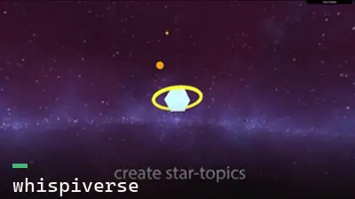
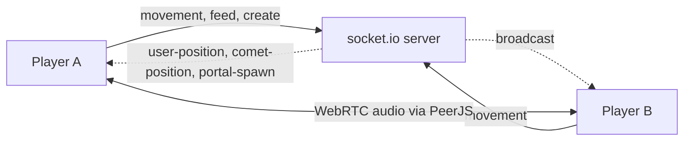

# Whispiverse

A browser 3D multiplayer world where players fly around as comets, talk over proximity voice, and leave behind portals that only survive if others keep them alive.

## Why I built it

This is a 2022 WebXR and 3D experiment. I wanted a shared space that was social first: you can hear the people near you, and the landmarks you leave behind fade unless the community keeps feeding them.

## What it does

- Every player is a comet-shaped avatar in a shared Three.js scene
- Positions sync in real time over socket.io, so everyone sees everyone move
- Proximity voice chat over WebRTC, connected peer to peer
- Collect items to raise your score
- Spend score to plant a portal: a point of interest with a name, description, and image
- Portals have energy that drains over time and die unless nearby players feed them
- A soundtrack and collect sound effects, mixed through the Three.js audio listener

## How it works

Whispiverse runs a React shell over a hand-written Three.js scene. State and voice travel on two separate channels at once.



### Two channels: state on socket.io, voice on WebRTC

The game server carries authoritative world state over socket.io. Each frame the client emits its avatar position, and the server rebroadcasts everyone's positions plus a swarm of 50 comets it owns. Voice runs on its own path: PeerJS opens WebRTC audio calls straight between players, so speech never round-trips through the game server. The comet swarm is reconciled cheaply. On the first `comet-position` message the client builds all 50 meshes. After that, each update just writes new x, y, z onto the existing meshes by name. The full WebRTC voice mesh caps a room at a handful of players.

### Portals as a decaying, shared layer

Portals are what players leave behind. Creating one costs score (you need at least 3) and posts a name, description, and image to the backend. Each portal carries an energy value that counts down, shown as seconds remaining when you stand near it. Feeding a portal spends one of your points to keep it alive. Stop feeding it and it fades.

## Tech stack

- Frontend: React 17, Three.js 0.133, dat.gui, Webpack (Create React App shell)
- Realtime: socket.io for state, PeerJS (WebRTC) for proximity voice
- Backend: an Express companion server (not in this repo)
- HTTP: Axios for portal and user data

## Running it

```bash
yarn install
yarn start        # http://localhost:3000
```

Two caveats if you clone this. It needs the companion server (portal and user endpoints, socket events), which originally ran on Heroku and is offline now. Point the client at your own. It also asks for microphone access on load, because voice connects the moment you join the room.

## Status

Prototype from 2022. The 3D world, movement sync, voice, and portals all work against a live server.
